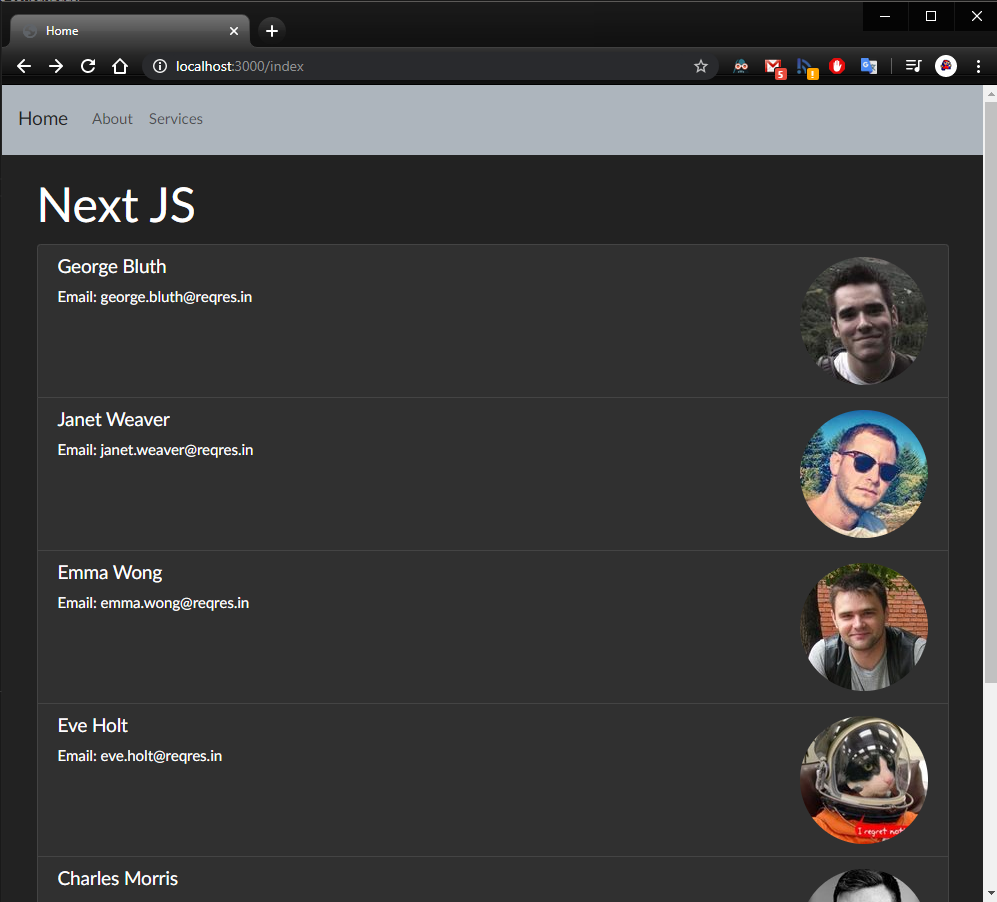

## Nextjs Curso Práctico | Framework de Server Side Rendering basado en React:

- https://www.youtube.com/watch?v=Tn6QYliFBcs

---

## Live demo:

- <a href="https://nextjsfaztcode.jonatandb.now.sh/" target="_blank">Next Js Fazt Code</a> Live Demo

---

## Screenshots:

    

    

---

## Ejecutar mediante:

1:

<pre>
 npm install
</pre>

2:

<pre>
 npm run dev
</pre>

3 - Navegar a:

<pre>
 http://localhost:3000
</pre>

---

## Páginas consultadas:

BootstrapCDN - Bootswatch 4

- https://www.bootstrapcdn.com/bootswatch/

Bootstrap Navbar

- https://getbootstrap.com/docs/4.5/components/navbar/

HTML to JSX Compiler

- https://magic.reactjs.net/htmltojsx.htm

JSONPlaceholder / Users API

- https://jsonplaceholder.typicode.com/users

REQ | RES / Users API

- https://reqres.in/api/users

NPM - Isomorphic Unfetch

- https://www.npmjs.com/package/isomorphic-unfetch

Create a Next.js App

- https://nextjs.org/learn/basics/create-nextjs-app

getInitialProps

- https://nextjs.org/docs/api-reference/data-fetching/getInitialProps

vscode package.json String does not match the pattern

- https://stackoverflow.com/questions/48694816/vscode-package-json-string-does-not-match-the-pattern

Deployment on Vercel

- https://nextjs.org/docs/deployment

---

    

